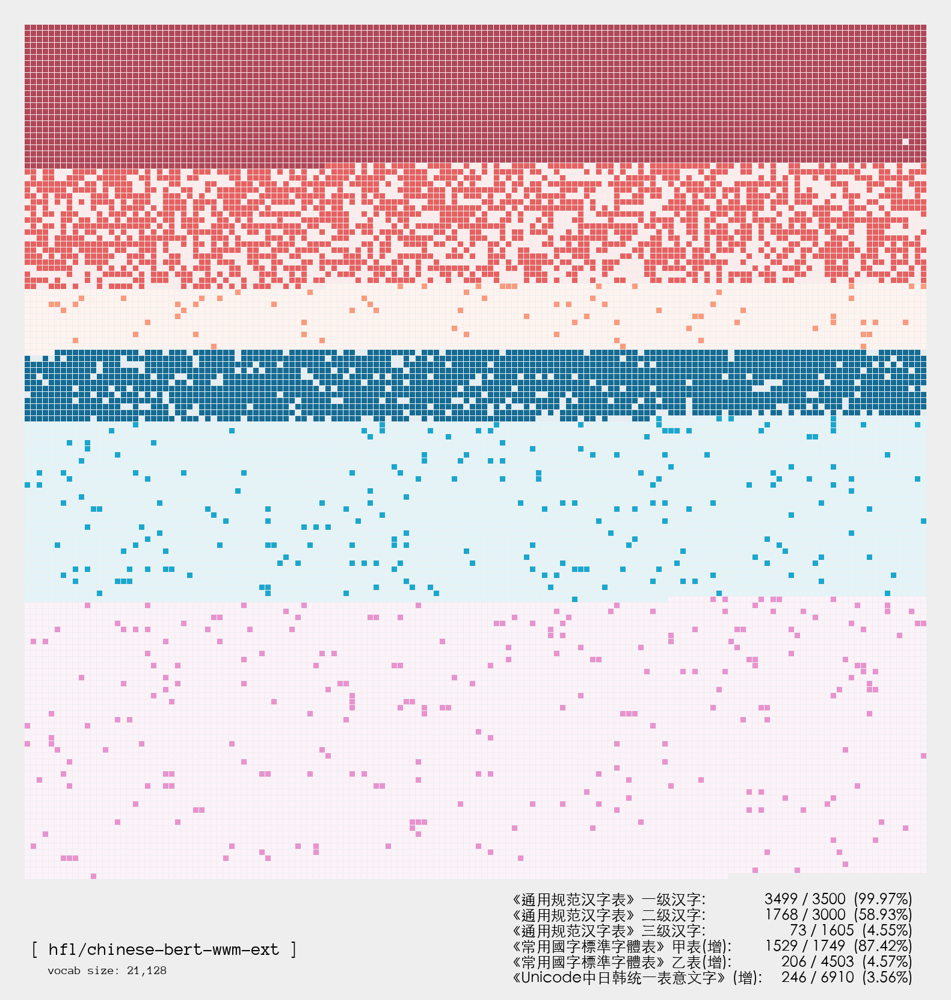
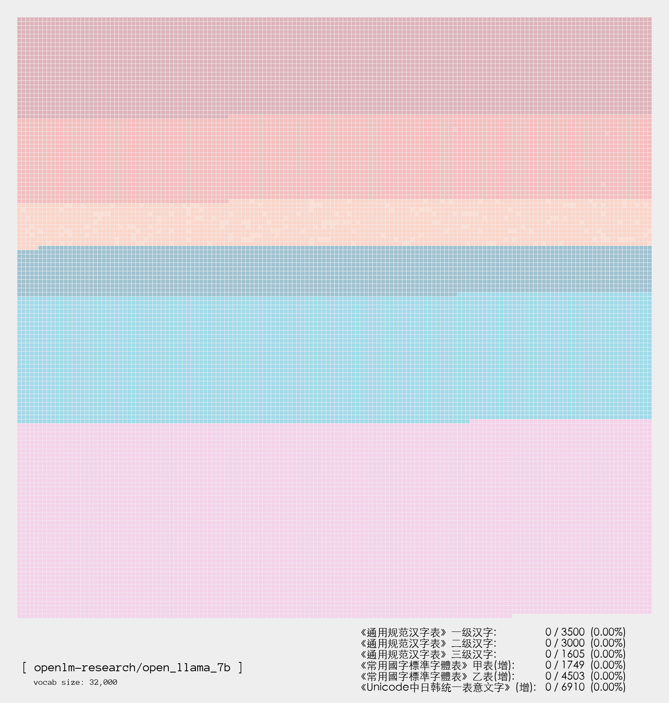
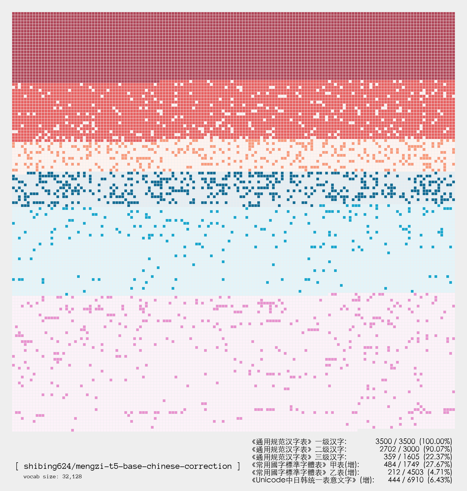
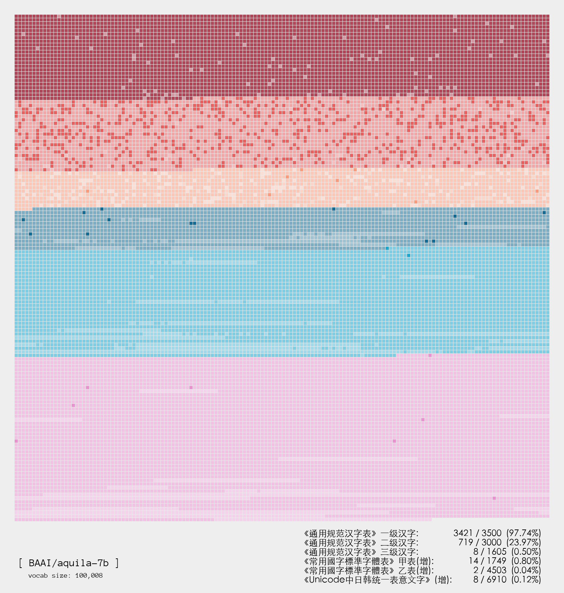
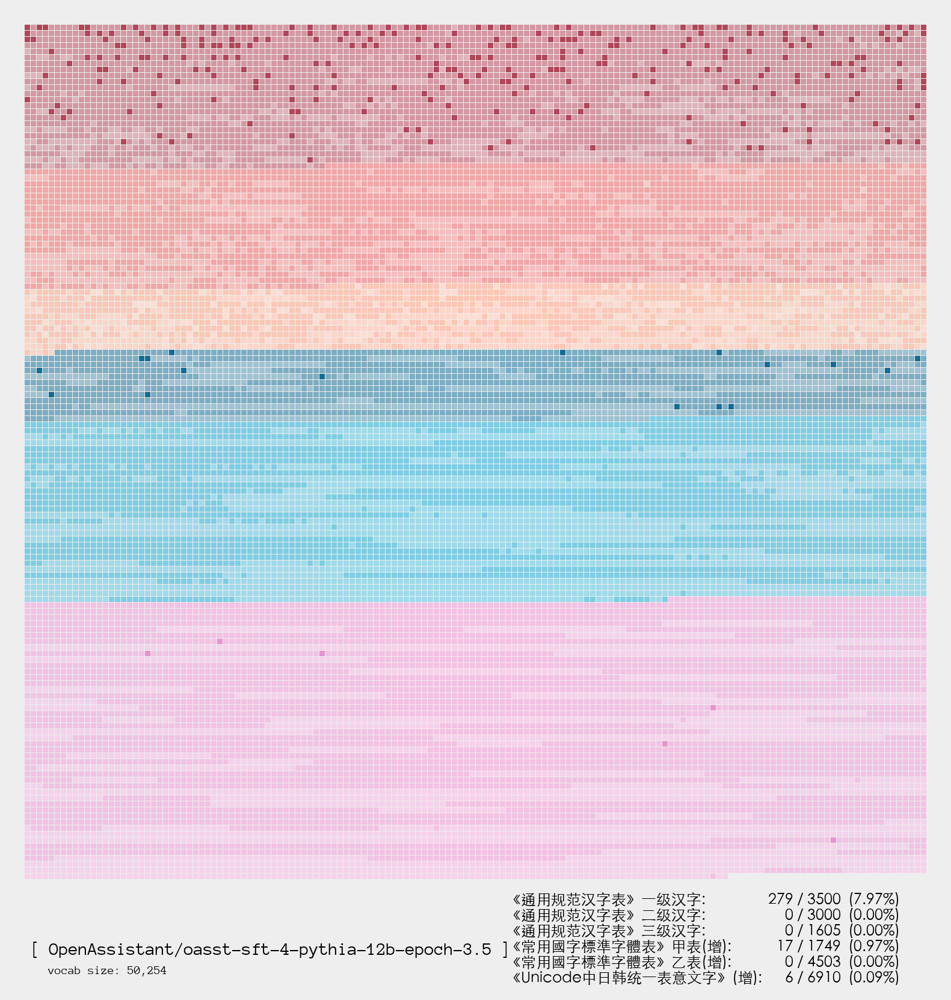

# 语言模型中文识字率分析

- [语言模型中文识字率分析](#语言模型中文识字率分析)
  - [项目介绍](#项目介绍)
  - [分析结果](#分析结果)
    - [原生的BERT类的模型](#原生的bert类的模型)
    - [Sentence BERT 提供的模型](#sentence-bert-提供的模型)
    - [基于 bert-base-chinese 字表的模型](#基于-bert-base-chinese-字表的模型)
    - [ERNIE](#ernie)
    - [基于原生 LLaMA 的模型](#基于原生-llama-的模型)
    - [基于汉字扩表后的 LLaMA 的模型](#基于汉字扩表后的-llama-的模型)
    - [中文大语言模型](#中文大语言模型)
    - [其它大语言模型](#其它大语言模型)
    - [OpenAI 模型](#openai-模型)

## 项目介绍

本项目的目的是为了调查各个语言模型的中文识字率的情况，以此可以作为后续模型评估分析的参考。

为了分析模型的中文识字率，我们使用三个常用的字符集，总共`21267`个汉字。

- 中华人民共和国教育部于2013年颁布的[《通用规范汉字表》](https://zh.wikipedia.org/zh-cn/%E9%80%9A%E7%94%A8%E8%A7%84%E8%8C%83%E6%B1%89%E5%AD%97%E8%A1%A8)，在该字表中，共收录了 `8105` 个汉字，其中一级字表（常用字集）`3500`个，二级字表`3000`个，三级字表`1605`个。字表内容从[中文百科](https://www.zwbk2009.com/)中获取。
- 中華民國教育部頒布的[《常用國字標準字體表》](https://zh.wikipedia.org/zh-hant/%E5%B8%B8%E7%94%A8%E5%9C%8B%E5%AD%97%E6%A8%99%E6%BA%96%E5%AD%97%E9%AB%94%E8%A1%A8) 中的甲表和乙表。甲表收录常用字`4808`个，其中有`1749`个汉字不在《通用规范汉字表》中；乙表收录次常用字`6343`个，其中有`4503`个汉字不在《通用规范汉字表》中。统计汉字识字率时，将只针对增加的汉字进行统计，已经在《通用规范汉字表》中的汉字不再重复统计。
- [《Unicode中日韩统一表意文字》](https://zh.wikipedia.org/zh-cn/%E4%B8%AD%E6%97%A5%E9%9F%93%E7%B5%B1%E4%B8%80%E8%A1%A8%E6%84%8F%E6%96%87%E5%AD%97_(Unicode%E5%8D%80%E6%AE%B5))，为汉字在 Unicode 中的基本区段。在 Unicode 14.0 时，收录了 `20992` 个汉字，占据码位 `U+4E00`-`U+9FFF`。其中有`6910`个汉字，既不在《通用规范汉字表》中，也不在《常用國字標準字體表》中。统计汉字识字率时，将只针对增加的汉字进行统计，已经在《通用规范汉字表》和《常用國字標準字體表》中的汉字不在重复统计。汉字在 Unicode 中还有其它区段，总共将近9万汉字，但由于其它汉字不常使用，这里暂不纳入统计范围。

对于语言模型是否认知某个汉字的判断，我们通过对应语言模型所使用的 Tokenizer 是否可以对该汉字进行 `encode` 来判断。

- 模型不认识某汉字的判定为：
  - 模型对该汉字的编码结果为空；
  - 模型对该汉字的编码结果为 `unk_token_id`；
- 模型认识某汉字的判定为：
  - 模型对该汉字的编码结果长度为1；
- 如果编码结果长度大于1，这有可能是因为使用了 BBPE 的原因，一个不常出现的汉字被拆分成了多个 token。由于汉字被以UTF-8的形式编码，拆散该编码并不能体现汉字语义，因此，一个汉字被打散的编码越多，我们认为该模型对该汉字的认知程度可能越低。所以，对于编码结果长度大于1的情况，我们认为该模型对该汉字的认知程度为 `1 / len(encode_result)`，用以控制半透明程度。在识字率的计数中，将计数为 `0`。

> 在进行判断前，会先行去除前缀后缀的特殊token。

## 分析结果

### 原生的BERT类的模型

|                   |                     |
|-------------------|---------------------|
|||
|||
|||

### Sentence BERT 提供的模型

|                                                       |                                                        |
|-------------------------------------------------------|--------------------------------------------------------|
| | |
| | |
| | |
| | |

### 基于 bert-base-chinese 字表的模型

|                                        |                                             |
|----------------------------------------|---------------------------------------------|
|       |       |
|||
|| |

### ERNIE

|                                        |                                             |
|----------------------------------------|---------------------------------------------|
|   |       |
|||
|||

### 基于原生 LLaMA 的模型

|                                        |                                             |
|----------------------------------------|---------------------------------------------|
|       |     |
|       |     |
|       |     |
|       |    |

### 基于汉字扩表后的 LLaMA 的模型

|                                        |                                             |
|----------------------------------------|---------------------------------------------|
|       |      |

### 中文大语言模型

|                                        |                                             |
|----------------------------------------|---------------------------------------------|
| |             |
| |  |
|  |  |

### 其它大语言模型

|                                        |                                             |
|----------------------------------------|---------------------------------------------|
|    |    |
|      |     |
| |                      |

### OpenAI 模型

|                                        |                                             |
|----------------------------------------|---------------------------------------------|
|    |    |
|      |     |
|      |     |
